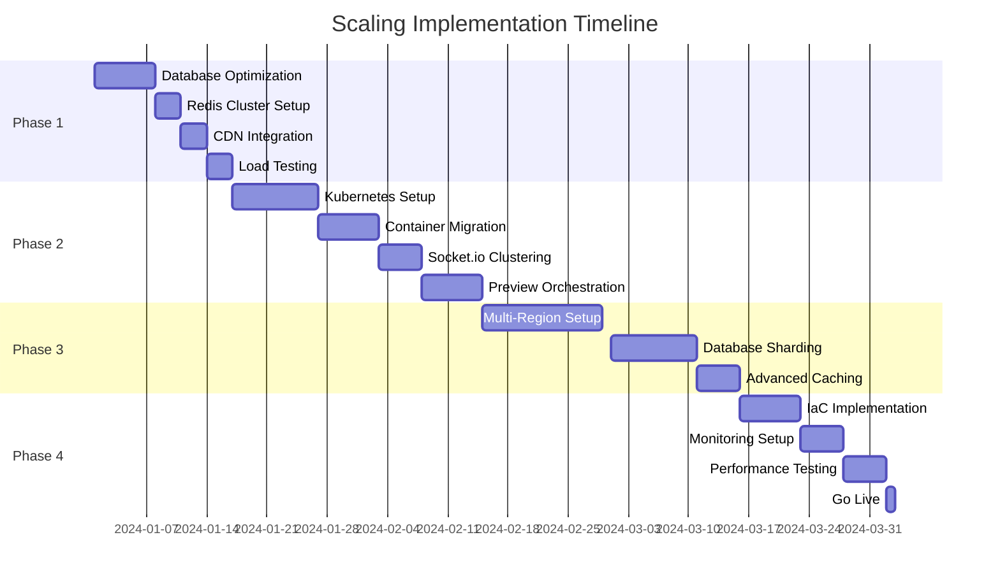

# Scaling Covibes to 100k Users - Complete Strategy

## Current Architecture Analysis

### Bottlenecks Identified
1. **Single EC2 instance** - All traffic goes through one server
2. **Single PostgreSQL database** - No read replicas or sharding
3. **Single Redis instance** - No Redis cluster
4. **Direct port mapping** for preview containers (port exhaustion)
5. **No CDN** for static assets
6. **No horizontal scaling** for Socket.io connections
7. **Complex iframe proxy setup** needs optimization

## Scaling Architecture (100k Users)

### Phase 1: Immediate Optimizations (1-10k users)

#### 1.1 Database Optimization
```yaml
# docker-compose.production.yml
services:
  postgres-primary:
    image: postgres:15-alpine
    environment:
      - POSTGRES_MAX_CONNECTIONS=500
      - POSTGRES_SHARED_BUFFERS=2GB
      - POSTGRES_EFFECTIVE_CACHE_SIZE=6GB
    volumes:
      - ./postgres-config/postgresql.conf:/etc/postgresql/postgresql.conf

  postgres-replica:
    image: postgres:15-alpine
    environment:
      - POSTGRES_MASTER_SERVICE=postgres-primary
    depends_on:
      - postgres-primary

  pgbouncer:
    image: pgbouncer/pgbouncer:latest
    environment:
      - DATABASES_HOST=postgres-primary
      - DATABASES_PORT=5432
      - POOL_MODE=transaction
      - MAX_CLIENT_CONN=1000
      - DEFAULT_POOL_SIZE=25
```

#### 1.2 Redis Cluster Setup
```yaml
redis-master:
  image: redis:7-alpine
  command: redis-server --appendonly yes --maxmemory 2gb --maxmemory-policy allkeys-lru

redis-replica-1:
  image: redis:7-alpine
  command: redis-server --slaveof redis-master 6379

redis-sentinel:
  image: redis:7-alpine
  command: redis-sentinel /etc/redis-sentinel/sentinel.conf
```

#### 1.3 CDN Integration
```nginx
# Static assets through CloudFront/Cloudflare
location ~* \.(js|css|png|jpg|jpeg|gif|ico|svg|woff|woff2|ttf|eot)$ {
    expires 1y;
    add_header Cache-Control "public, immutable";
    add_header Vary Accept-Encoding;
}
```

### Phase 2: Kubernetes Migration (10k-50k users)

#### 2.1 Kubernetes Manifests
```yaml
# k8s/deployment-backend.yaml
apiVersion: apps/v1
kind: Deployment
metadata:
  name: covibes-backend
spec:
  replicas: 10  # Start with 10 pods
  selector:
    matchLabels:
      app: covibes-backend
  template:
    metadata:
      labels:
        app: covibes-backend
    spec:
      containers:
      - name: backend
        image: covibes/backend:latest
        ports:
        - containerPort: 3001
        env:
        - name: DATABASE_URL
          valueFrom:
            secretKeyRef:
              name: db-secret
              key: url
        resources:
          requests:
            memory: "512Mi"
            cpu: "500m"
          limits:
            memory: "1Gi"
            cpu: "1000m"
        livenessProbe:
          httpGet:
            path: /health
            port: 3001
          initialDelaySeconds: 30
          periodSeconds: 10
---
apiVersion: v1
kind: Service
metadata:
  name: covibes-backend
spec:
  selector:
    app: covibes-backend
  ports:
  - port: 3001
    targetPort: 3001
  type: ClusterIP
---
apiVersion: autoscaling/v2
kind: HorizontalPodAutoscaler
metadata:
  name: covibes-backend-hpa
spec:
  scaleTargetRef:
    apiVersion: apps/v1
    kind: Deployment
    name: covibes-backend
  minReplicas: 10
  maxReplicas: 100
  metrics:
  - type: Resource
    resource:
      name: cpu
      target:
        type: Utilization
        averageUtilization: 70
  - type: Resource
    resource:
      name: memory
      target:
        type: Utilization
        averageUtilization: 80
```

#### 2.2 Socket.io Sticky Sessions with Redis Adapter
```yaml
# k8s/socket-deployment.yaml
apiVersion: apps/v1
kind: Deployment
metadata:
  name: covibes-websocket
spec:
  replicas: 20  # Dedicated WebSocket servers
  template:
    spec:
      containers:
      - name: websocket
        image: covibes/websocket:latest
        env:
        - name: REDIS_URL
          value: redis://redis-cluster:6379
        - name: SOCKET_IO_REDIS_ADAPTER
          value: "true"
---
# Nginx Ingress with sticky sessions
apiVersion: networking.k8s.io/v1
kind: Ingress
metadata:
  name: covibes-ingress
  annotations:
    nginx.ingress.kubernetes.io/affinity: "cookie"
    nginx.ingress.kubernetes.io/affinity-mode: "persistent"
    nginx.ingress.kubernetes.io/session-cookie-expires: "86400"
spec:
  rules:
  - host: covibes.com
    http:
      paths:
      - path: /socket.io
        pathType: Prefix
        backend:
          service:
            name: covibes-websocket
            port:
              number: 3001
```

#### 2.3 Preview Container Orchestration
```yaml
# k8s/preview-controller.yaml
apiVersion: v1
kind: ConfigMap
metadata:
  name: preview-nginx-config
data:
  nginx.conf: |
    upstream preview_backend {
      least_conn;
      server preview-node-1:8080 max_fails=3 fail_timeout=30s;
      server preview-node-2:8080 max_fails=3 fail_timeout=30s;
      server preview-node-3:8080 max_fails=3 fail_timeout=30s;
    }

    server {
      listen 80;

      location ~ ^/preview/([^/]+)/(.*)$ {
        set $team_id $1;
        set $path $2;

        # Dynamic resolution based on team
        proxy_pass http://preview-$team_id.preview.svc.cluster.local:8080/$path;

        # WebSocket support for HMR
        proxy_http_version 1.1;
        proxy_set_header Upgrade $http_upgrade;
        proxy_set_header Connection "upgrade";

        # Caching for static assets
        location ~* \.(js|css|png|jpg|jpeg|gif|ico)$ {
          proxy_cache preview_cache;
          proxy_cache_valid 200 60m;
          proxy_cache_use_stale error timeout updating;
        }
      }
    }
---
# Preview deployment template with resource limits
apiVersion: apps/v1
kind: Deployment
metadata:
  name: preview-template
spec:
  replicas: 1
  template:
    spec:
      containers:
      - name: preview
        resources:
          requests:
            memory: "256Mi"
            cpu: "250m"
          limits:
            memory: "512Mi"
            cpu: "500m"
      nodeSelector:
        node-role: preview  # Dedicated preview nodes
```

### Phase 3: Full Scale Architecture (50k-100k users)

#### 3.1 Multi-Region Setup
```yaml
# AWS EKS Multi-Region
regions:
  - us-east-1:  # Primary
      eks_cluster: covibes-primary
      rds_cluster: covibes-db-primary
      elasticache: covibes-redis-primary

  - eu-west-1:  # Europe
      eks_cluster: covibes-eu
      rds_read_replica: covibes-db-eu
      elasticache: covibes-redis-eu

  - ap-southeast-1:  # Asia
      eks_cluster: covibes-asia
      rds_read_replica: covibes-db-asia
      elasticache: covibes-redis-asia

# Route53 Geolocation Routing
route53:
  - record: api.covibes.com
    type: Geolocation
    routing_policy:
      - location: North America -> us-east-1-alb
      - location: Europe -> eu-west-1-alb
      - location: Asia -> ap-southeast-1-alb
```

#### 3.2 Database Sharding Strategy
```javascript
// Shard by teamId for horizontal scaling
const getDbShard = (teamId) => {
  const shardKey = parseInt(teamId.substring(0, 8), 16);
  const shardIndex = shardKey % NUM_SHARDS;
  return dbShards[shardIndex];
};

// Connection pooling per shard
const dbShards = [
  new PrismaClient({ datasources: { db: { url: process.env.DB_SHARD_0 } } }),
  new PrismaClient({ datasources: { db: { url: process.env.DB_SHARD_1 } } }),
  new PrismaClient({ datasources: { db: { url: process.env.DB_SHARD_2 } } }),
  new PrismaClient({ datasources: { db: { url: process.env.DB_SHARD_3 } } }),
];
```

#### 3.3 Caching Layer
```javascript
// Redis caching with fallback
class CacheService {
  async get(key, fallbackFn) {
    try {
      // Try L1 cache (Redis)
      const cached = await redis.get(key);
      if (cached) return JSON.parse(cached);

      // Try L2 cache (Local memory)
      if (memoryCache.has(key)) {
        return memoryCache.get(key);
      }

      // Fallback to database
      const data = await fallbackFn();

      // Write-through cache
      await redis.setex(key, 3600, JSON.stringify(data));
      memoryCache.set(key, data);

      return data;
    } catch (error) {
      return fallbackFn();
    }
  }
}
```

### Phase 4: Infrastructure as Code

#### 4.1 Terraform Configuration
```hcl
# terraform/main.tf
module "eks" {
  source = "terraform-aws-modules/eks/aws"

  cluster_name    = "covibes-production"
  cluster_version = "1.27"

  node_groups = {
    general = {
      desired_capacity = 20
      max_capacity     = 100
      min_capacity     = 10

      instance_types = ["t3.xlarge"]

      k8s_labels = {
        Environment = "production"
        NodeType    = "general"
      }
    }

    preview = {
      desired_capacity = 30
      max_capacity     = 200
      min_capacity     = 20

      instance_types = ["t3.large"]

      k8s_labels = {
        NodeType = "preview"
      }

      taints = [{
        key    = "preview"
        value  = "true"
        effect = "NO_SCHEDULE"
      }]
    }
  }
}

module "rds" {
  source = "terraform-aws-modules/rds-aurora/aws"

  name           = "covibes-aurora"
  engine         = "aurora-postgresql"
  engine_version = "15.4"

  instances = {
    1 = {
      instance_class = "db.r6g.2xlarge"
    }
    2 = {
      instance_class = "db.r6g.xlarge"
      promotion_tier = 1
    }
  }

  autoscaling_enabled      = true
  autoscaling_min_capacity = 2
  autoscaling_max_capacity = 10
}
```

#### 4.2 Helm Charts
```yaml
# helm/covibes/values.yaml
global:
  environment: production
  domain: covibes.com

backend:
  replicaCount: 50
  image:
    repository: covibes/backend
    tag: latest
  autoscaling:
    enabled: true
    minReplicas: 20
    maxReplicas: 100
    targetCPUUtilizationPercentage: 70
  resources:
    requests:
      cpu: 500m
      memory: 512Mi
    limits:
      cpu: 2000m
      memory: 2Gi

websocket:
  replicaCount: 30
  stickySession: true
  redisAdapter: true

preview:
  maxContainersPerNode: 50
  resourceQuota:
    requests.cpu: "100"
    requests.memory: "200Gi"
    limits.cpu: "200"
    limits.memory: "400Gi"

monitoring:
  prometheus:
    enabled: true
  grafana:
    enabled: true
  alertmanager:
    enabled: true
```

### Phase 5: Monitoring & Observability

#### 5.1 Prometheus Metrics
```yaml
# k8s/prometheus-config.yaml
apiVersion: v1
kind: ConfigMap
metadata:
  name: prometheus-config
data:
  prometheus.yml: |
    global:
      scrape_interval: 15s

    scrape_configs:
    - job_name: 'covibes-backend'
      kubernetes_sd_configs:
      - role: pod
        selectors:
        - role: pod
          label: "app=covibes-backend"

    - job_name: 'node-exporter'
      kubernetes_sd_configs:
      - role: node

    alerting:
      alertmanagers:
      - static_configs:
        - targets: ['alertmanager:9093']

    rule_files:
    - '/etc/prometheus/alerts.yml'
---
apiVersion: v1
kind: ConfigMap
metadata:
  name: prometheus-alerts
data:
  alerts.yml: |
    groups:
    - name: covibes
      rules:
      - alert: HighMemoryUsage
        expr: (node_memory_MemTotal_bytes - node_memory_MemAvailable_bytes) / node_memory_MemTotal_bytes > 0.85
        for: 5m
        annotations:
          summary: "High memory usage detected"

      - alert: HighCPUUsage
        expr: 100 - (avg(irate(node_cpu_seconds_total{mode="idle"}[5m])) * 100) > 80
        for: 5m

      - alert: PodCrashLooping
        expr: rate(kube_pod_container_status_restarts_total[15m]) > 0
        for: 5m

      - alert: PreviewContainerQuotaExceeded
        expr: sum(kube_pod_container_resource_requests{container="preview"}) > 180000
        for: 1m
```

#### 5.2 Application Metrics
```javascript
// server/src/metrics.ts
import { register, Counter, Histogram, Gauge } from 'prom-client';

export const metrics = {
  httpRequestDuration: new Histogram({
    name: 'http_request_duration_seconds',
    help: 'Duration of HTTP requests in seconds',
    labelNames: ['method', 'route', 'status'],
    buckets: [0.1, 0.5, 1, 2, 5]
  }),

  activeWebsocketConnections: new Gauge({
    name: 'websocket_connections_active',
    help: 'Number of active WebSocket connections',
    labelNames: ['teamId']
  }),

  previewContainersActive: new Gauge({
    name: 'preview_containers_active',
    help: 'Number of active preview containers',
    labelNames: ['projectType', 'teamId']
  }),

  agentExecutions: new Counter({
    name: 'agent_executions_total',
    help: 'Total number of agent executions',
    labelNames: ['agentType', 'status']
  }),

  databaseQueryDuration: new Histogram({
    name: 'database_query_duration_seconds',
    help: 'Duration of database queries',
    labelNames: ['operation', 'table'],
    buckets: [0.01, 0.05, 0.1, 0.5, 1]
  })
};

// Middleware to track metrics
export const metricsMiddleware = (req, res, next) => {
  const start = Date.now();

  res.on('finish', () => {
    const duration = (Date.now() - start) / 1000;
    metrics.httpRequestDuration
      .labels(req.method, req.route?.path || 'unknown', res.statusCode)
      .observe(duration);
  });

  next();
};
```

### Cost Optimization

#### Monthly Cost Estimate (100k users)
```yaml
AWS Services:
  EKS Clusters (3 regions):
    - Control Plane: $219/month ($73 x 3)
    - Worker Nodes (150 total): ~$5,400/month

  RDS Aurora PostgreSQL:
    - Primary + 2 Read Replicas: ~$1,800/month
    - Storage (1TB): ~$100/month

  ElastiCache Redis:
    - 3 clusters: ~$600/month

  Application Load Balancers:
    - 3 ALBs: ~$75/month

  CloudFront CDN:
    - 10TB transfer: ~$850/month

  S3 Storage:
    - Logs/Backups (500GB): ~$25/month

  Data Transfer:
    - Inter-region: ~$500/month

  Total: ~$9,569/month

Cost Optimization Strategies:
  - Use Spot Instances for preview containers (70% savings)
  - Reserved Instances for predictable workloads (40% savings)
  - Auto-scaling to reduce idle capacity
  - S3 Intelligent Tiering for logs
  - CloudFront caching to reduce origin requests

Optimized Total: ~$6,000/month
```

### Implementation Timeline



## Quick Start Commands

### Local Testing with Kind
```bash
# Create local Kubernetes cluster
kind create cluster --name covibes-test --config kind-config.yaml

# Install Nginx Ingress
kubectl apply -f https://raw.githubusercontent.com/kubernetes/ingress-nginx/main/deploy/static/provider/kind/deploy.yaml

# Deploy application
helm install covibes ./helm/covibes -f helm/covibes/values-dev.yaml

# Port forward for testing
kubectl port-forward svc/covibes-backend 3001:3001
```

### Production Deployment
```bash
# Setup AWS EKS
eksctl create cluster --config-file=eksctl-config.yaml

# Install required controllers
kubectl apply -f https://github.com/kubernetes-sigs/aws-load-balancer-controller/releases/download/v2.4.4/v2_4_4_full.yaml

# Deploy with Helm
helm upgrade --install covibes ./helm/covibes \
  -f helm/covibes/values-production.yaml \
  --namespace production \
  --create-namespace

# Setup monitoring
helm install prometheus prometheus-community/kube-prometheus-stack
```

## Key Decisions for Scale

1. **Kubernetes over ECS**: Better for complex microservices and preview containers
2. **Aurora PostgreSQL**: Auto-scaling, read replicas, better than RDS
3. **Redis Cluster with Sentinel**: High availability for sessions/cache
4. **CloudFront CDN**: Reduce load on origin servers
5. **Horizontal Pod Autoscaling**: Dynamic scaling based on metrics
6. **Preview containers on dedicated nodes**: Isolation and resource management
7. **WebSocket sticky sessions**: Required for Socket.io at scale
8. **Multi-region deployment**: Reduce latency globally

## Security Considerations

1. **Network Policies**: Isolate preview containers
2. **RBAC**: Kubernetes role-based access control
3. **Secrets Management**: AWS Secrets Manager / Kubernetes Secrets
4. **WAF**: AWS WAF on CloudFront and ALB
5. **VPC**: Private subnets for databases
6. **Container Scanning**: ECR vulnerability scanning
7. **Audit Logging**: CloudTrail and Kubernetes audit logs

This architecture will handle 100k+ concurrent users with room for growth.