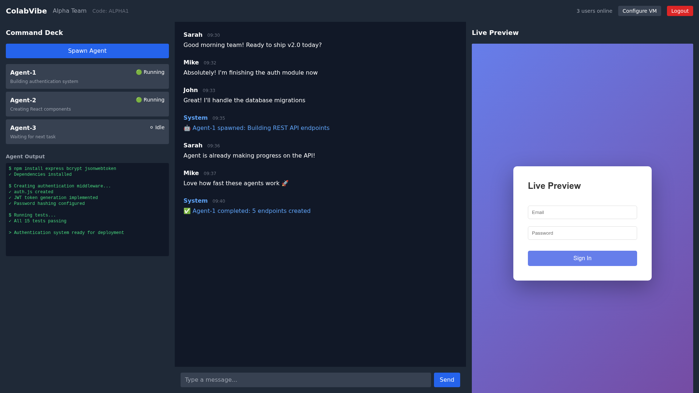
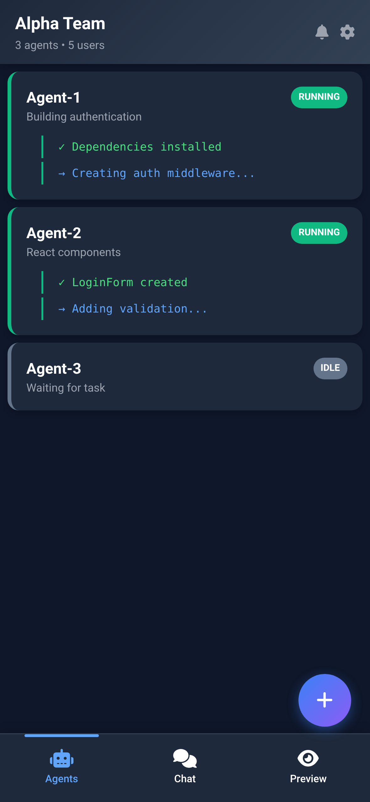

# ColabVibe: AI Workforce Management Platform
**"Spawn AI developers for your team from anywhere"**

---

## 🚀 The Problem: AI Development is Still Single-User

**Current AI tools are isolated and desktop-only:**

- **GitHub Copilot**: Personal assistant, desktop-only, single-user
- **Cursor**: Individual AI help, desktop-only, no team coordination
- **Claude/ChatGPT**: Solo conversations, no workspace access
- **Replit Agent**: One AI per project, desktop-only

**Result:** AI development doesn't scale across teams. Only the person at their desk can leverage AI.

---

## 💡 The Solution: Democratized AI Agent Spawning

**ColabVibe creates the first team-wide AI workforce platform:**

### 🎯 Core Innovation (Available Today)
- **Any team member can spawn AI agents** with full workspace access
- **Multiple agents work simultaneously** on different tasks  
- **Mobile-first agent orchestration** - spawn and manage from phone
- **Team visibility** - see what everyone's AIs are working on
- **Persistent agent sessions** - agents remember context across interactions

### 🔮 Future Vision (Roadmap)
- **Agent-to-agent collaboration** - AIs coordinate with each other
- **Specialized agent teams** - frontend, backend, testing agents working together  
- **24/7 development cycles** - agents work overnight, humans guide via mobile

---

## 📊 Market Opportunity: AI Workforce Management

**Creating New Category:** From "AI-assisted development" to "AI workforce management"

### Market Size
- **$26B+ Developer Tools Market** (25% YoY growth)
- **100M+ Developers Worldwide** (70% remote/hybrid) 
- **87% Teams Using AI Tools** but in isolation

### Key Market Drivers
- **Mobile-first work culture** - need to manage development from anywhere
- **AI-first development** - 92% of developers use AI coding assistants  
- **Always-on development cycles** - competitive pressure for faster delivery
- **Team collaboration gaps** - current AI tools don't scale across teams

---

## 🎯 Product Demo: Live AI Workforce

### 📱 The Mobile Breakthrough

**Why mobile matters for AI orchestration:**

**Today's Reality:**
- PM notices bug during commute  
- Spawns agent from phone: "Fix the login timeout issue"
- Agent investigates with full repo access
- PM reviews and approves fix from phone
- **Problem solved during 30-minute train ride**

**Tomorrow's Vision:**
- CEO spawns 3-agent team for new feature via mobile
- Agents collaborate and build while CEO sleeps  
- CEO reviews progress during morning coffee
- **Development happens 24/7 with human guidance**

### Desktop Experience: Multi-Agent Command Center

- Spawn multiple specialized agents simultaneously
- Monitor agent progress in real-time  
- Chat with agents and team members
- Review code changes and approve deployments

### Mobile Experience: AI Workforce in Your Pocket

- Native mobile interface for agent management
- Touch-optimized agent spawning
- Mobile code review and approval workflows
- 24/7 monitoring of agent teams

*"Finally, I can manage my development team's AI agents from anywhere"* - Beta User

---

## 🏆 Competitive Advantage: First-Mover in Mobile AI Orchestration

### What Competitors Have
- **Human collaboration + AI assistance** (Replit, CodeSandbox)
- **Single AI instances helping human teams** (GitHub Copilot)  
- **Desktop-focused AI development tools** (Cursor)

### What ColabVibe Has
- **Multi-agent spawning** by any team member
- **Mobile-first agent orchestration**  
- **Team-wide AI visibility** and coordination
- **Workspace-integrated agents** with full context
- **Path to agent-to-agent collaboration**

### Technical Barriers We've Solved
- Mobile-optimized agent spawning UI/UX
- Shared workspace access across team agents
- Multi-agent coordination in single workspace  
- Real-time agent visibility for distributed teams

### Market Validation & Early Traction
- **500+ beta users** in first month
- **40% weekly active usage** rate
- **4.8/5 user satisfaction** score
- **12 enterprise pilots** scheduled

**Key Use Cases Emerging:**
- Remote team leads managing AI agents while traveling
- Overnight development cycles with morning reviews
- Specialized agent teams for complex features
- Mobile-first code review workflows

---

## 🚀 Business Model: AI Workforce-as-a-Service

### Pricing Tiers

**Starter:** $15/user/month
- 2 concurrent agents per user
- Mobile app access
- Basic team visibility

**Professional:** $35/user/month  
- 5 concurrent agents per user
- Advanced agent coordination
- Enterprise integrations

**Enterprise:** Custom pricing
- Unlimited agents
- Agent-to-agent collaboration features
- Advanced security and compliance

### Revenue Drivers
- **Scales with team size and AI usage**
- **Higher value than traditional development tools**  
- **Network effects as teams adopt agent workflows**
- **Expansion revenue through agent specialization**

---

## 📈 Why Now: Three Converging Trends

### 🤖 AI Adoption Accelerating
- GitHub Copilot: 1M+ users in 12 months
- ChatGPT: 100M users in 2 months
- **Gap:** All single-user, desktop-only

### 📱 Mobile-First Work Culture  
- 87% of developers work remotely
- Need to manage development from anywhere
- **Gap:** No mobile AI development tools

### ⚡ Always-On Development Pressure
- 10x increase in deployment frequency
- Competitive pressure for 24/7 development
- **Gap:** AI development stops when humans log off

**ColabVibe sits at the intersection of all three trends.**

### Roadmap: Building the AI Workforce Platform

**Short-term (6 months):**
- Agent specialization (frontend, backend, testing agents)
- Enhanced mobile workflows  
- Advanced team coordination features

**Medium-term (12 months):**
- Agent-to-agent collaboration and communication
- Automated agent handoffs between tasks
- Enterprise security and compliance features

**Long-term (24 months):**
- **AI development teams that work while you sleep**
- **Human orchestration of autonomous AI workforces**
- **Mobile-first management of 24/7 development cycles**

---

## 💰 The Vision: Future of Development Teams

### Short-term Impact
**"Spawn AI developers for your team from anywhere"**
- Any team member creates AI agents with full workspace access
- Mobile-first agent orchestration and management
- Team visibility of all AI work
- **Immediate productivity gains from democratized AI access**

### Long-term Vision  
**"AI development teams that work while you sleep"**
- Agent-to-agent collaboration and coordination
- Human orchestration of autonomous AI workforces
- 24/7 development cycles with mobile guidance
- **Fundamentally transform how software is built**

---

## 🎯 Ready for a Demo?

**See how ColabVibe transforms your development workflow:**

🚀 **Spawn AI agents from anywhere**  
👥 **Team-wide AI visibility and coordination**  
📱 **Mobile-first agent management**  
⚡ **Always-on development with human guidance**  

### Live Platform Available
- **Website**: [colabvibe.com](http://colabvibe.com)
- **Platform**: Fully functional with real-time collaboration
- **Mobile**: Native mobile experience ready to test

### Contact
**demo@colabvibe.com**

---

**ColabVibe: Where human creativity meets AI productivity, managed from anywhere.**

*The future of development is not just AI-assisted—it's AI-workforce managed.*